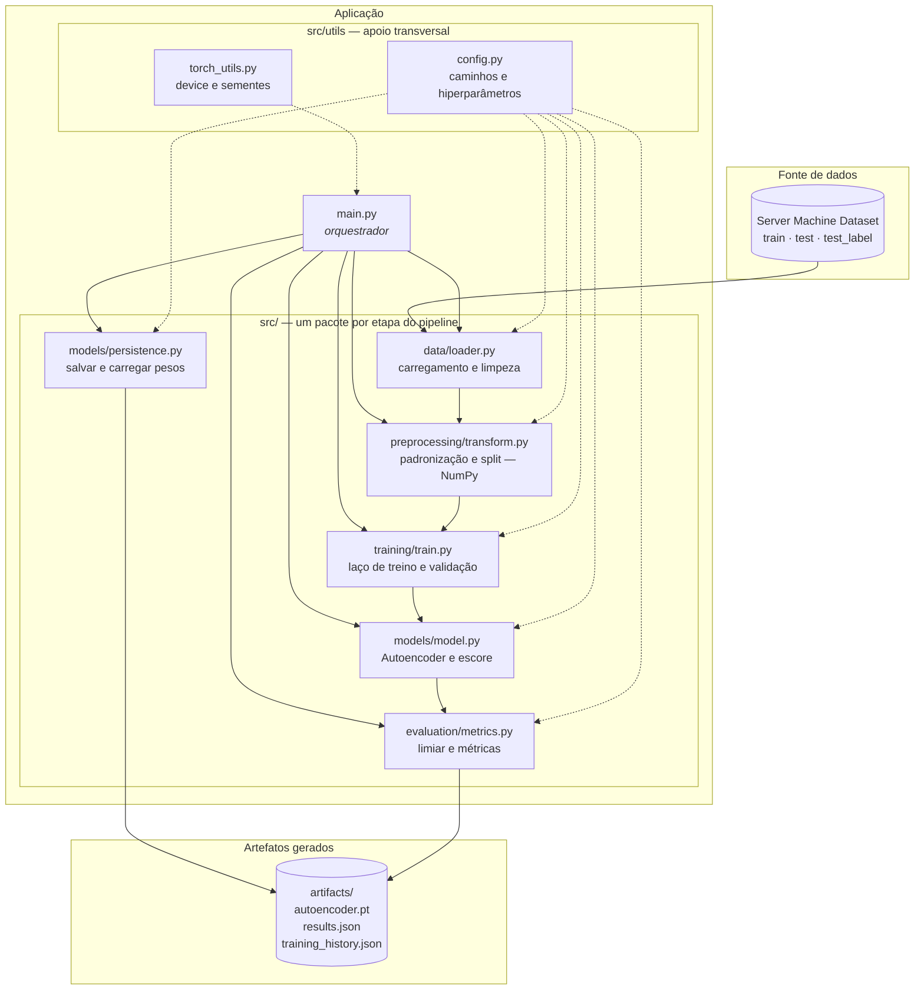

# Arquitetura do sistema

Este documento descreve a arquitetura do **Detector de Anomalias em Métricas de Servidores
(SMD)**: quais são os componentes, do que cada um é responsável, por onde os dados passam e
**por que** a separação foi feita assim. Ele complementa o
[documento de requisitos](requisitos/), que diz *o que* o sistema deve fazer.

O sistema não é um script único de treino: é um pipeline modular em que cada etapa —
carregamento, pré-processamento, modelo, treino, avaliação — é um pacote independente, com
contrato de entrada e saída explícito e testes próprios.

---

## 1. Visão de componentes



> Linha cheia = fluxo de dados. Linha tracejada = dependência de apoio (configuração e
> utilitários), que não carrega dados do pipeline.

**Regra de dependência: as setas nunca voltam.** Nenhum pacote de `src/` importa o `main.py`,
e `utils/` não importa ninguém do pipeline. Quem conhece a ordem das etapas é apenas o
orquestrador — por isso é possível usar o pré-processamento ou as métricas fora do pipeline
(nos testes, por exemplo) sem arrastar o resto junto.

---

## 2. Fluxo de dados fim a fim

```mermaid
flowchart LR
    A["arquivos .txt<br/>sem cabeçalho"] -->|"load_data"| B["DataFrame<br/>(N, 38)"]
    B -->|"clean_data · clean_aligned"| C["DataFrame limpo<br/>índice preservado"]
    C -->|"to_numpy"| D["ndarray<br/>(N, 38)"]
    D -->|"split_data<br/>corte temporal 80/20"| E["treino · validação"]
    E -->|"standardize<br/>z-score"| F["ndarray padronizado"]
    F -->|"build_dataloader<br/>janela deslizante"| G["tensores<br/>(batch, 50, 38)"]
    G -->|"train_model"| H["Autoencoder treinado"]
    H -->|"save_model"| I[("autoencoder.pt")]
    H -->|"reconstruction_error"| J["erro por janela"]
    J -->|"reconstruction_threshold<br/>percentil 99,5 do treino"| K["limiar"]
    J --> L["predict_anomalies"]
    K --> L
    L -->|"calculate_metrics"| M[("results.json")]
```



**A fronteira NumPy → PyTorch é explícita e fica em um lugar só.** Tudo até a padronização é
pandas/NumPy; a conversão para tensor acontece dentro de `build_dataloader`
(`src/training/train.py:46`) e de `reconstruction_error` (`src/models/model.py:137`). Nenhum
outro módulo manipula tensores.

**Alinhamento janela → instante.** Cada janela de 50 amostras produz um erro, associado ao
**último** timestep da janela. Por isso a comparação com os rótulos usa
`y_test[WINDOW_SIZE - 1:]` — o deslocamento é tratado explicitamente no `main.py`, e não
escondido dentro de uma função.

---

## 3. Responsabilidade de cada módulo

| Módulo | Responsabilidade | Entrada → saída | Depende de |
|---|---|---|---|
| `src/utils/config.py` | Fonte única de caminhos e hiperparâmetros | — | — |
| `src/utils/torch_utils.py` | Device de execução e sementes de aleatoriedade | — | torch, config |
| `src/data/loader.py` | Ler os arquivos do SMD e remover linhas inválidas preservando o alinhamento entre métricas e rótulos | caminho → `DataFrame` | pandas |
| `src/preprocessing/transform.py` | Padronizar (z-score) e dividir a série preservando a ordem temporal | `ndarray` → `ndarray` | NumPy |
| `src/models/model.py` | Definir o autoencoder (`nn.Module`, `forward`) e calcular o erro de reconstrução por janela | tensor → tensor · matriz → erros | torch, config |
| `src/models/persistence.py` | Salvar e carregar os pesos (`state_dict`) | modelo ↔ arquivo `.pt` | torch, model |
| `src/training/train.py` | Montar `TensorDataset`/`DataLoader` e executar o laço de treino/validação | matrizes → modelo treinado + histórico | torch, model, config |
| `src/evaluation/metrics.py` | Derivar o limiar, binarizar os erros e calcular precisão, recall, F1 e acurácia | erros + rótulos → métricas | NumPy |
| `main.py` | Orquestrar as etapas na ordem correta e registrar os resultados | — | todos |
| `tests/` | 13 testes `unittest` sobre carregamento, pré-processamento, modelo e treino | — | unittest |

`main.py` é o único ponto de execução: `python main.py` roda o pipeline inteiro, do arquivo
bruto ao `results.json`.

---

## 4. Decisões arquiteturais

| # | Decisão | Por quê |
|---|---|---|
| D1 | **Um pacote por etapa do pipeline**, não por tipo de arquivo | Cada etapa tem um dono e um arquivo de teste correspondente; mudança no modelo não toca o carregamento. Foi o que permitiu várias pessoas trabalharem em paralelo sem conflito de merge. |
| D2 | **Pré-processamento em NumPy, antes de qualquer tensor** | Mantém `data/` e `preprocessing/` executáveis **sem `torch` instalado** — o que na prática destravou colegas cujo ambiente não tinha PyTorch. |
| D3 | **Configuração centralizada** em `src/utils/config.py` | Trocar janela, épocas ou percentil do limiar é editar uma linha, não caçar constantes espalhadas. É o que torna viável comparar configurações experimentais. |
| D4 | **`standardize` com `mean`/`std` opcionais** (modo *fit* e modo *transform*) | Validação e teste são padronizados com as estatísticas do **treino**. Sem isso haveria vazamento de informação do teste para o pré-processamento. |
| D5 | **Split temporal, não aleatório** | A série é temporal: embaralhar antes de dividir treinaria o modelo com o futuro. `split_data` corta em ordem e devolve os índices para auditoria. |
| D6 | **Persistência separada da definição do modelo** | `persistence.py` grava só o `state_dict`; a arquitetura fica em `model.py`. Carregar exige recriar a mesma estrutura, o que evita depender da serialização da classe. |
| D7 | **Orquestração só no `main.py`** | Os módulos não sabem em que ordem são chamados — quem sabe é o orquestrador. Cada função pode ser testada isoladamente. |
| D8 | **Métricas em NumPy puro**, sem `scikit-learn` | Uma dependência a menos, e o cálculo de precisão/recall fica auditável e testável linha a linha. |
| D9 | **Limiar derivado do percentil dos erros de treino** (99,5) | A partição de treino do SMD não contém anomalias: o que o modelo considera "normal" vem dos dados, não de um número escolhido à mão. |
| D10 | **Early stopping com restauração da melhor época** | O treino segue além do melhor ponto, então os pesos salvos são os da melhor época — e `ResultadoTreino` carrega essa época junto, para o resultado ser reproduzível. |

---

## 5. Estrutura de pastas

```
detector-anomalias-smd/
├── main.py                         # ponto único de execução do pipeline
├── requirements.txt
├── src/
│   ├── data/loader.py              # carregamento e limpeza (pandas)
│   ├── preprocessing/transform.py  # padronização e split (NumPy)
│   ├── models/
│   │   ├── model.py                # Autoencoder (nn.Module) e erro de reconstrução
│   │   └── persistence.py          # salvar/carregar state_dict
│   ├── training/train.py           # DataLoader, laço de treino e validação
│   ├── evaluation/metrics.py       # limiar, predição e métricas
│   └── utils/
│       ├── config.py               # caminhos e hiperparâmetros
│       └── torch_utils.py          # device e sementes
├── tests/                          # test_data · test_preprocessing · test_model · test_training
├── docs/                           # requisitos (GR4ML) e esta arquitetura
├── data/                           # SMD (não versionado)
└── artifacts/                      # modelo e resultados gerados (não versionado)
```

A pasta espelha o diagrama da seção 1: **um diretório por responsabilidade**, e o nome do
diretório diz a etapa do pipeline. `tests/` espelha `src/` na mesma granularidade — um
arquivo de teste por pacote —, então é imediato saber onde um comportamento é verificado.

---

## 6. Onde cada coisa acontece

| Etapa | Onde | Observação |
|---|---|---|
| Carregamento | `loader.load_data` | Arquivos do SMD, sem cabeçalho, uma coluna por métrica |
| Limpeza | `loader.clean_data` · `clean_aligned` | `clean_aligned` remove a mesma linha de métricas **e** de rótulos, mantendo o pareamento |
| Pré-processamento | `transform.standardize` · `split_data` | NumPy; estatísticas ajustadas só no treino |
| Treino | `train.train_model` | Adam, `MSELoss`, early stopping, `ReduceLROnPlateau`, gradient clipping |
| Inferência / escore | `model.reconstruction_error` | Modo `eval` e `inference_mode`, em lotes |
| Decisão de anomalia | `metrics.reconstruction_threshold` · `predict_anomalies` | Limiar do percentil dos erros de treino |
| Avaliação | `metrics.calculate_metrics` | Precisão, recall, F1 e acurácia |
| Persistência | `persistence.save_model` → `artifacts/autoencoder.pt` | Pesos; histórico e resultados em JSON no mesmo diretório |

Execução de referência (`machine-1-1`, 71 épocas executadas, melhor época 61): erro de
validação **0,1896**, limiar **1,379**, **precisão 0,2531**, **recall 0,8805**, F1 **0,3931**.
O recall alto com precisão baixa é consequência direta de D9 — o percentil 99,5 privilegia
sensibilidade e paga com volume de alerta.

---

## 7. Rastreabilidade: requisito → componente

| Requisito | Onde é atendido | Situação |
|---|---|---|
| RF-01 — escore por janela | `model.reconstruction_error` | ✅ Atendido |
| RF-02 — classificar a janela | `metrics.predict_anomalies` | ✅ Atendido |
| RF-03 — erro decomposto por métrica | — | ⬜ Do sistema-alvo; o protótipo devolve o erro médio da janela |
| RF-04 — aprender o padrão normal | `train.train_model` sobre a partição de treino, sem rótulos | ✅ Atendido |
| RF-05 — persistir modelo, limiar e estatísticas | `persistence.save_model` (pesos) + `results.json` (limiar) | 🟠 Parcial: `mean`/`std` da padronização não são persistidos |
| RF-06 — limiar por percentil, registrado | `metrics.reconstruction_threshold` + `results.json` | ✅ Atendido |
| RF-07 — precisão, recall e F1 registrados | `metrics.calculate_metrics` → `results.json` | 🟠 Parcial: falta o percentual de janelas sinalizadas |
| RNF-01 — baixa taxa de falso positivo | `metrics.precision_score` | ✅ Medido |
| RNF-02 — localizar as métricas responsáveis | — | ⬜ Depende do RF-03 |
| RNF-03 — treino sem GPU dedicada | `torch_utils.get_device` (CPU por padrão) | ✅ Atendido |
| RNF-04 — cobertura de degradações combinadas | `metrics.recall_score` | 🟠 Medido, mas sem comparação com o baseline de limiar por métrica |

---

## 8. Limitações conhecidas

- **Não há pacote `src/inference/`.** A inferência hoje é a composição de
  `reconstruction_error` + `predict_anomalies`, chamada pelo `main.py`. Quando houver consumo
  de dados novos fora do pipeline de avaliação, esse é o próximo módulo a nascer.
- **O erro é agregado por janela, não por dimensão** — é o que impede RF-03 e RNF-02. A
  mudança é localizada: `reconstruction_error` já calcula a diferença por feature antes de
  aplicar a média.
- **`artifacts/` não é versionado**, então os números da seção 6 só são reproduzidos rodando
  `python main.py`.
- **Validação restrita à `machine-1-1`**, com janela de 50 amostras. O pipeline aceita outras
  máquinas trocando `FILE_NAME` em `config.py`, mas não há execução registrada.
